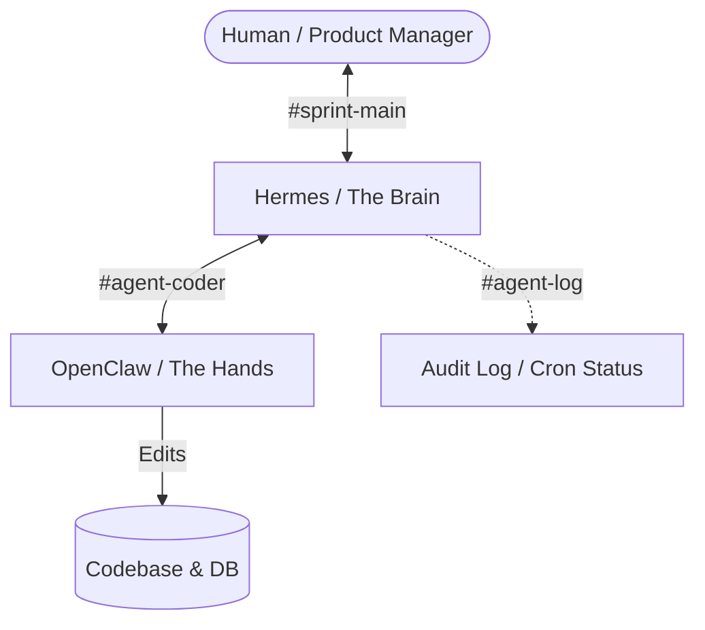

# System Architecture

This document describes the multi-agent system architecture used for the Forge 2 Qualifier Kanban Board application.

## 1. Agent Orchestration Framework

We utilize a two-agent hierarchy:
1. **Hermes (The Brain / Orchestrator):**
   - **Role:** Handles planning, task decomposition, progress verification, and interaction with the user (the Human).
   - **Model:** `Gemini 2.5 Flash` or `GPT-OSS-120B`. Requires strong reasoning, memory maintenance, and planning capabilities.
   - **Constraint:** Never writes code directly; delegates all code changes to OpenClaw.
2. **OpenClaw (The Hands / Executor):**
   - **Role:** Implements the specific coding tasks, updates database schemas, creates UI components, and reports output back to Hermes.
   - **Model:** `Llama-3.3-70B-Versatile` or `Qwen2.5-Coder`. Leverages fast token throughput and precise code generation capabilities.

## 2. Slack Communication Protocol

Everything is communicated via dedicated Slack channels (no direct messages):
- **`#sprint-main`:** Shared channel between Human and Hermes for approving implementation plans, verifying phases, and making design decisions.
- **`#agent-coder`:** Direct channel between Hermes and OpenClaw for assigning specific programming tasks and returning completion logs.
- **`#agent-log`:** Read-only channel showing raw agent actions, autonomous cron status updates, and runtime diagnostics.

## 3. Model Routing Strategy & Reasoning

- **Hermes (Gemini 2.5 Flash):** High-context window and advanced reasoning capabilities. Crucial for understanding complete system specs, keeping track of checklist progress, and scheduling timers.
- **OpenClaw (Llama 3.3 70B):** Cost-effective, high-throughput model optimized for code syntax, Laravel artisan commands, React hooks, and CSS styling.
